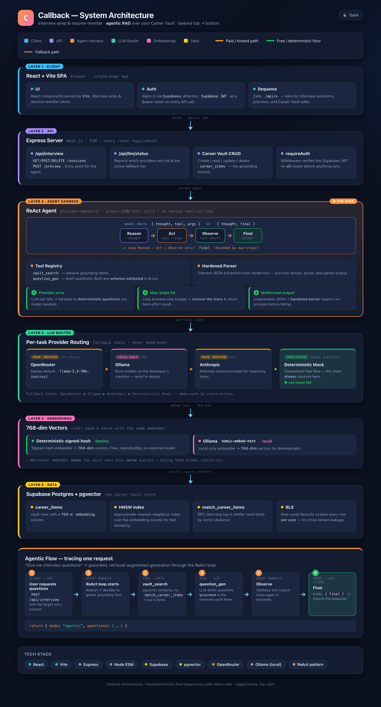

# Callback

**Tailor the résumé. Rehearse the interview. Land the callback.**

Callback turns one saved job into a vault-grounded résumé, a matching cover letter, a 0–100 fit score, and a spoken mock interview — every answer built from your real career history, so you walk in ready. It's an **agentic RAG** app: a longitudinal *Career Vault* of atomic career facts grounds everything the model writes, with provenance you can trace back to the source.

> **Origin.** Callback was scaffolded from [**Sprint Zero**](https://github.com/yousuf-labs/sprint-zero) — a Claude Code kit that spins up a full sub-agent product team (scoping → specs → parallel build → QA) from one reference URL. Sprint Zero produced the initial React + Express + Supabase skeleton and the spec set in [`docs/`](docs/); everything since — the Career Vault, the ReAct agent harness, the LLM router, and the Interview Studio — is Callback-specific work built on top. Sprint Zero is part of the [Enterprise RAG & Multi-Agent Applications](https://maven.com/boring-bot/advanced-llm) course by [Yousuf Alvi](https://github.com/yousuf-alvi) and [Hamza Farooq](https://www.linkedin.com/in/hamzafarooq/). See [Acknowledgments](#acknowledgments).

---

## What it does

- **Career Vault** — your longitudinal record of atomic career facts (experience, projects, achievements, skills, education). Each item is embedded into pgvector on write; every tailored bullet and interview question is grounded in — and cites — an item here. Upload a résumé (PDF / Word / text) once to seed it, or build it by hand.
- **Tailor in minutes** — generate a résumé and cover letter shaped to one specific job, drawn from your vault via vector retrieval with provenance you can trust.
- **Score the fit** — a 0–100 match score with matched and missing keywords tells you what to fix *before* you apply.
- **Interview Studio** — behavioral STAR questions generated from the **job description** and grounded in your vault, read aloud, with your spoken answers recorded and transcribed (swappable voice seam).
- **Track the pipeline** — move every job from Bookmarked → Applied → Interviewing → Offer on one board. Import a posting straight from a link (Greenhouse / Lever / JSON-LD, SSRF-guarded).
- **Free to run** — every feature works with no paid dependency. See [The free floor](#the-free-floor).

---

## How it works

One agent, two jobs. Sign in (Supabase, per-user RLS), pick a goal, and the same **ReAct** engine runs — but each side is grounded in the source that fits it: **interview prep** reads the **job description** you paste; the **resume rewriter** calls `vault_search` to pull your **real wins** from the Career Vault. Every run is saved as a session you can revisit, and a fallback chain ending in a free deterministic floor keeps a live demo from ever dead-ending.


> 📐 **Interactive version:** open [`docs/how-it-works.html`](docs/how-it-works.html) in a browser (light/dark toggle).

---

## Architecture

Requests flow top → bottom through six layers — Client → API → **ReAct agent harness** → LLM router → embeddings → Supabase/pgvector — and every path bottoms out in a **free, deterministic floor** so the demo can never dead-end. No paid dependency is ever required.



> 📐 **Interactive, themeable version:** open [`docs/architecture.html`](docs/architecture.html) in a browser for the light/dark toggle and the same layout live.

A few load-bearing details from the diagram:

- **The LLM router never dead-ends.** `OpenRouter ▶ Ollama ▶ Anthropic ▶ Deterministic Mock` — each provider hands off to the next when it's absent or fails, and the deterministic mock is a guaranteed-free floor that always resolves.
- **The agent harness is provider-agnostic.** It drives a Reason → Act → Observe → Final loop over plain-JSON tool calls (no native tool-calling), with a hardened parser and a deterministic-question fallback so a bad model response never breaks the request.
- **Seed and serve with the same embedder.** Whichever embedder writes the 768-dim vectors into the vault must also embed queries, or cosine similarity breaks — deterministic signed-hash on deploy, Ollama `nomic-embed-text` locally.

### The free floor

The guarantee: **the free/local path always works.** A deterministic mock is the guaranteed-free floor for generation, and a deterministic 768-dim signed-hash embedder stands in whenever Ollama is absent. Add an `OPENROUTER_API_KEY` (or run Ollama locally, or add an `ANTHROPIC_API_KEY`) to upgrade quality — but nothing is *required*, and no paid tier gates any feature.

---

## Stack

| Layer            | Technology                                                              |
| ---------------- | ----------------------------------------------------------------------- |
| Frontend         | React + Vite (`client/`)                                                |
| Backend          | Express, Node.js (ESM) — every route `requireAuth` (`server/`)          |
| Database + Auth  | Supabase — Postgres + **pgvector**, Row-Level Security, Supabase Auth   |
| Retrieval        | pgvector cosine similarity via a `match_career_items` RPC (HNSW index)  |
| LLM router       | OpenRouter ▶ Ollama (local) ▶ Anthropic ▶ deterministic mock            |
| Embeddings       | Deterministic signed-hash (deploy) / Ollama `nomic-embed-text` (local)  |

---

## Quick start

### 1. Prerequisites

- [Node.js](https://nodejs.org) 18+
- A free [Supabase](https://supabase.com) project (Postgres + Auth). Enable **Authentication → Providers → Email**.
- *(Optional)* an `OPENROUTER_API_KEY`, a local [Ollama](https://ollama.com), or an `ANTHROPIC_API_KEY` for AI-quality output. Skip all three and the deterministic floor still runs.

### 2. Configure the server

```bash
git clone https://github.com/datasistah/callback
cd callback/server
cp .env.example .env
# open .env and fill in the Supabase values (URL, publishable + secret keys, DATABASE_URL).
# LLM keys are optional — leave them blank to run on the free floor.
```

The four Supabase values come from your project's **Settings → API** (Project URL, publishable key, secret key) and **Settings → Database → Connection string → URI** (`DATABASE_URL`, session mode, port 5432).

### 3. Create tables and seed the demo

```bash
# from server/
npm install
npm run migrate   # applies migrations/ (career_items + pgvector, interview, jobs)

# Optional: seed Maya Rivera's demo account (profile + vault). Choose the
# password via DEMO_PASSWORD — nothing is hardcoded. Skip this entirely if you
# just want to sign up fresh.
DEMO_PASSWORD='choose-your-own' npm run seed
```

`seed.js` prints the demo email on completion, and the password only when it
creates the account (from `DEMO_PASSWORD`, or a random one it generates and
prints once). Or just **sign up** in the app — with Google or your own email.

### 4. Run it

```bash
# Terminal 1 — API on http://localhost:3001
cd server && npm start

# Terminal 2 — app on http://localhost:5173
cd client
cp .env.example .env   # first run — paste VITE_SUPABASE_URL and VITE_SUPABASE_PUBLISHABLE_KEY
npm install
npm run dev
```

Open [http://localhost:5173](http://localhost:5173) and **sign up** — with Google or your own email — or log in with the demo account if you seeded one. Vite only exposes `VITE_`-prefixed env vars to the browser, which is why the client needs its own `.env`.

---

## Tests

Hermetic server-side suites — no DB, no network, no env — covering the RAG logic, the agent harness, interview generation, job import, and the MCP surface:

```bash
cd server
node tests/vault.unit.test.js
node tests/agent.unit.test.js
node tests/interview.unit.test.js
node tests/jobimport.unit.test.js
node tests/mcp.unit.test.js
```

---

## Repo layout

```
callback/
├── client/                 ← React + Vite SPA
│   └── src/
│       ├── pages/            Board, JobDetail, Profile, Vault, InterviewStudio
│       ├── api/client.js     typed fetch wrapper (Bearer JWT)
│       ├── auth/             Supabase session provider
│       └── voice/            swappable speech-to-text seam
├── server/                 ← Express API (ESM)
│   ├── routes/               interview · jobs · profile · vault
│   ├── lib/                  vault (RAG) · tailor · score · interview · jobimport · ai
│   ├── harness/              agent (ReAct) · llm (router) · embeddings
│   ├── mcp/                  MCP server surface
│   ├── middleware/auth.js    requireAuth — verifies the Supabase JWT
│   ├── migrations/           001_init · 002_career_vault · 003_interview
│   ├── migrate.js · seed.js · reset-demo.js
├── docs/                   ← specs (from Sprint Zero) + architecture diagram
│   ├── architecture.html     interactive, themeable
│   ├── architecture.png       rendered for this README
│   └── prd.md · api-contract.md · scope.md · decisions.md · …
├── samples/                ← sample résumés (txt/pdf/docx) for testing uploads
└── README.md
```

---

## Acknowledgments

Callback started from **Sprint Zero**, the scaffolding kit that generated its first working skeleton and spec set:

- **[Yousuf Alvi](https://github.com/yousuf-alvi)** ([LinkedIn](https://www.linkedin.com/in/yousufalvi/)) — original author of Sprint Zero, published at [yousuf-labs/sprint-zero](https://github.com/yousuf-labs/sprint-zero).
- **[Hamza Farooq](https://www.linkedin.com/in/hamzafarooq/)** — course integration, [Enterprise RAG & Multi-Agent Applications](https://maven.com/boring-bot/advanced-llm).

The scaffold produced the initial `client/` + `server/` + Supabase wiring and the documents in `docs/`. The Career Vault, the RAG-grounded tailoring, the ReAct agent harness and LLM router, and the Interview Studio are Callback's own build on top of that foundation.

MIT licensed. See [LICENSE](LICENSE).
